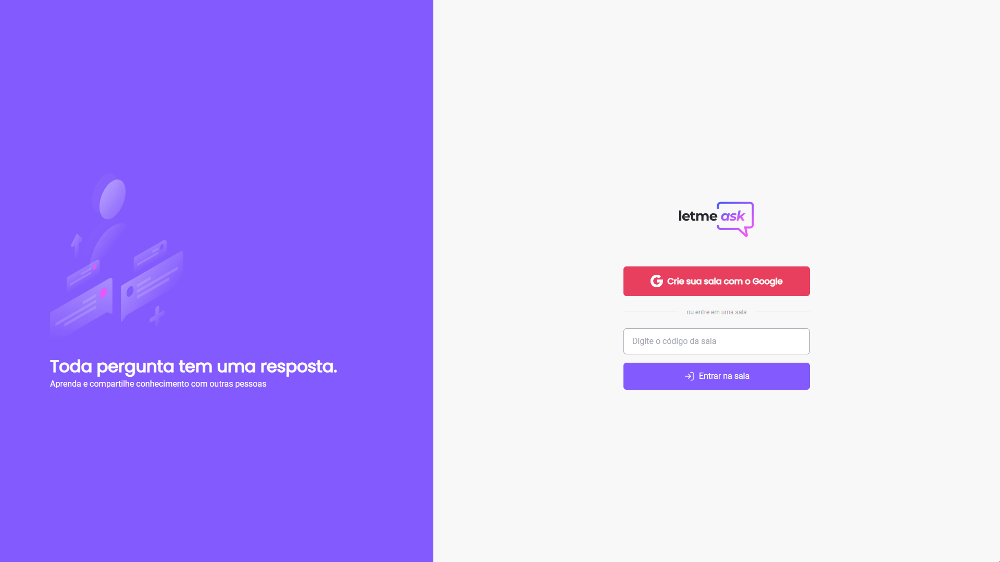

<p align="center">
  
</p>

<h1 align="center">
    
</h1>

<br>

## 💻 Projeto

LetMeAsk é uma plataforma perfeita para criadores de conteúdos poderem criar salas de dúvidas/perguntas para seu público, de uma forma muito organizada e democrática.

Este é um projeto desenvolvido durante a **[Next Level Week Together](https://nextlevelweek.com/)** by Rocketseat.

## 🧪 Tecnologias

Esse projeto foi desenvolvido com as seguintes tecnologias:

- [React](https://reactjs.org)
- [Firebase](https://firebase.google.com/)
- [TypeScript](https://www.typescriptlang.org/)

## 📚 Bibliotecas

Para auxiliar no desenvolvimento do projeto, utilizei as seguinte bibliotecas:

- [StyledComponents](https://styled-components.com)
- [ReactToastify](https://fkhadra.github.io/react-toastify/introduction)

## 🚀 Como executar

Clone o projeto e acesse a pasta, a seguir temos os passos:

```bash
$ git clone https://github.com/adairjuneoaf/letmeask
$ cd letmeask
```

Para iniciá-lo, siga os passos abaixo:

```bash
# Instalar as dependências
$ yarn
# Iniciar o projeto
$ yarn dev
```

O app estará disponível no seu navegador de internet pelo endereço http://localhost:3000.

Lembrando que será necessário criar uma conta no [Firebase](https://firebase.google.com/) e um projeto para disponibilizar um Realtime Database.
Além disso é necessário que você configure corretamente as variáveis globais disponibilizadas pelo firebase no ato de criação do seu projeto no console da Google.

## 📝 License

Utilize o projeto a vontade, mas demonstre os minimos créditos 🧡.

---

Feito por um apaixonado em tecnologia, [Adair Juneo](https://portfolio.prismasystems.com.br)
